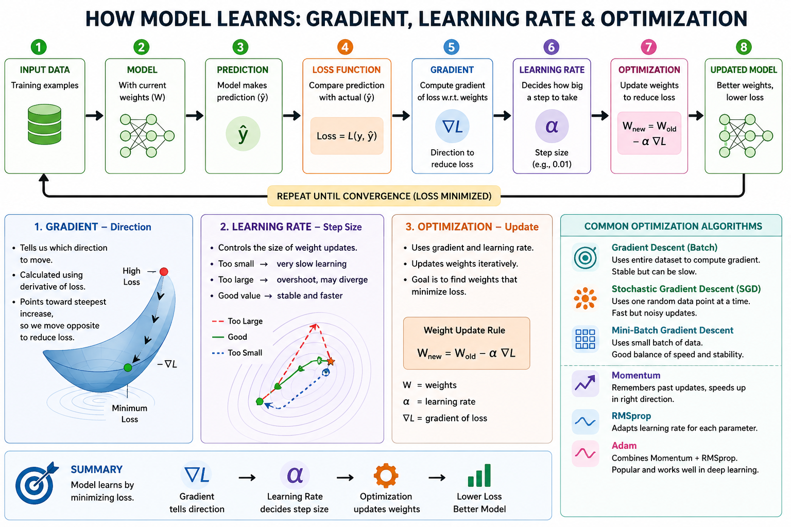

# Gradient-learning rate-optimization

## 🧠 Model Training Flow Diagram

This diagram explains how a machine learning model learns step by step. It starts with input data, which is used to train the model. The model has some initial weights (parameters), usually random at the beginning. Using these weights, the model makes predictions on the data.

Next, the model compares its predictions with the actual true values using a loss function. This gives an error value, which shows how far the prediction is from the correct answer. The goal of the model is to reduce this error as much as possible.

To reduce the error, the model calculates something called the gradient. The gradient tells the model the direction it should move to reduce the loss. You can think of it like being on a hill—the gradient shows the steepest way down toward the lowest point (minimum loss).

However, knowing the direction is not enough. The model also needs to decide how big a step to take in that direction. This is controlled by the learning rate. A small learning rate means slow but steady learning(stable convergence), while a large learning rate can cause overshooting of the minimum, leading to instability or divergence(missing the best solution).

Using both the gradient (direction) and learning rate (step size), the optimization process updates the model’s weights. This update helps the model make better predictions next time. This process is repeated many times in a loop until the loss becomes very small and the model performs well.

The diagram also shows different optimization methods like batch gradient descent, stochastic gradient descent, and mini-batch gradient descent, which differ in how much data they use for each update. Advanced methods like Adam and RMSprop further improve learning by adjusting the updates automatically.

**RMSprop:**

It looks at past gradients and adjusts the step size.

If gradients are large, it takes smaller steps.

If gradients are small, it takes bigger steps.

This keeps learning stable and prevents large updates.

It works well when the data is noisy or complex.

**Adam:**

It remembers past gradients (direction + size).

Uses that memory to update weights smartly.

Moves faster in the right direction. Learning is faster and more efficient.

It performs well in most deep learning problems.

**NOTE**

A **loss function** measures the error for a single prediction by comparing the predicted value with the actual value.

A **cost function** is the average of these losses over the entire dataset and is minimized during model training.

Here are different loss functions 

| Loss Function                 | Used For              | Key Idea                 | Outlier Sensitivity | When to Use              |
| ----------------------------- | --------------------- | ------------------------ | ------------------- | ------------------------ |
| **MSE**                       | Regression            | Squares errors           | High              | When large errors matter |
| **MAE**                       | Regression            | Absolute errors          | Low               | When data has outliers   |
| **Huber**                     | Regression            | Mix of MSE + MAE         | Medium             | Balanced approach        |
| **Binary Cross-Entropy**      | Binary Classification | Probability error        | High                 | Logistic regression, NN  |
| **Categorical Cross-Entropy** | Multi-class           | Probability distribution | High               | Softmax outputs          |
| **Hinge Loss**                | Classification (SVM)  | Margin-based             | Medium           | Clear class separation   |
| **Log-Cosh**                  | Regression            | Smooth MAE               | Low–Medium          | Stable + smooth training |

The overall process follows a continuous loop:

Predict → Calculate Loss → Compute Gradient → Update Weights → Repeat

This cycle helps the model learn patterns from data and improve performance over time.
